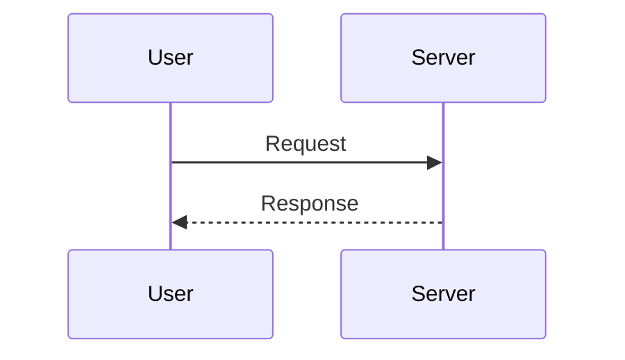

# Markdown Test Document

A single document exercising the full range of features a typical Markdown renderer needs to handle: CommonMark, GitHub Flavored Markdown (GFM), and a handful of common extensions (footnotes, definition lists, task lists, math, Mermaid). Use it as a fixture to verify styling, parsing, and edge cases.

---

## 1. Headings

# H1 — Heading Level 1
## H2 — Heading Level 2
### H3 — Heading Level 3
#### H4 — Heading Level 4
##### H5 — Heading Level 5
###### H6 — Heading Level 6

Alternate H1
============

Alternate H2
------------

### Heading with `inline code`, *emphasis*, and a [link](https://example.com)

---

## 2. Paragraphs and line breaks

This is a normal paragraph. It contains several sentences in a row. Renderers should collapse internal whitespace, wrap text naturally, and preserve sentence spacing as written.

This paragraph ends with two trailing spaces  
to force a hard line break. The next line should appear immediately below without a blank line between.

This paragraph uses a backslash\
to force a line break (CommonMark style).

A blank line between blocks produces a new paragraph.

---

## 3. Emphasis and text styling

- *Italic with asterisks* and _italic with underscores_
- **Bold with asterisks** and __bold with underscores__
- ***Bold and italic combined*** and ___also combined___
- ~~Strikethrough text~~ (GFM)
- ==Highlighted text== (extension; may not render everywhere)
- Inline `code span` with `backticks`
- H~2~O — subscript (extension)
- E = mc^2^ — superscript (extension)
- A mix: **bold with `code` inside** and *italic with [a link](https://example.com) inside*

Escaped characters: \*not italic\*, \`not code\`, \[not a link\], \\ literal backslash.

---

## 4. Blockquotes

> A single-line blockquote.

> A multi-line blockquote.
> Continuation on the next line should join the same block.
>
> A second paragraph inside the same blockquote, separated by a blank quoted line.

> **Nested blockquotes:**
>
> > Inner quote level 2.
> >
> > > Inner quote level 3 with `code`, *emphasis*, and a [link](https://example.com).

> #### Blockquote with a heading
>
> - List item one
> - List item two
>
> ```js
> // Code block inside a blockquote
> console.log("hello from inside a quote");
> ```

---

## 5. Lists

### 5.1 Unordered

- First item
- Second item
  - Nested item
  - Another nested item
    - Deeply nested item
- Third item

Using different markers (renderers should treat them equivalently):

* Star marker
+ Plus marker
- Hyphen marker

### 5.2 Ordered

1. First
2. Second
3. Third
   1. Nested ordered
   2. Nested ordered
4. Fourth

Starting from a different number:

7. Seven
8. Eight
9. Nine

### 5.3 Task lists (GFM)

- [x] Completed task
- [ ] Incomplete task
- [x] ~~Completed and struck through~~
- [ ] Task with **bold**, *italic*, and `code`
  - [ ] Nested incomplete subtask
  - [x] Nested completed subtask

### 5.4 Mixed content inside list items

1. A paragraph in a list item.

   A second paragraph in the same item, indented four spaces.

   > A blockquote inside a list item.

   ```python
   # A code block inside a list item
   def greet(name):
       return f"Hello, {name}!"
   ```

2. Another item with an image:

   

3. Another item with a table:

   | Key | Value |
   |-----|-------|
   | a   | 1     |
   | b   | 2     |

---

## 6. Links

- Inline link: [Anthropic](https://www.anthropic.com)
- Inline link with title: [Anthropic](https://www.anthropic.com "Anthropic homepage")
- Autolink: <https://example.com>
- Email autolink: <test@example.com>
- Reference-style link: [Reference link][ref-1]
- Collapsed reference link: [ref-2][]
- Shortcut reference link: [ref-3]
- Link to an internal anchor: [Jump to Tables](#9-tables)
- Link with `code` in the text: [`README.md`](./README.md)
- Link with special characters in URL: [Query](https://example.com/search?q=hello%20world&lang=en)

[ref-1]: https://example.com/one "Title one"
[ref-2]: https://example.com/two
[ref-3]: https://example.com/three

---

## 7. Images

Inline image:


Reference-style image:

![Reference image][img-ref]

[img-ref]: https://placehold.co/400x150 "Reference image title"

Image as a link:

[](https://example.com)

Image with empty alt (decorative):


---

## 8. Code

### 8.1 Inline

Use `print("hello")` to write to stdout. Backticks with literal backticks: `` `code` `` and ``` ``double backticks`` ```.

### 8.2 Indented code block (4 spaces)

    function legacy() {
        return "indented code block";
    }

### 8.3 Fenced code blocks with language hints

```javascript
// JavaScript
const greet = (name) => `Hello, ${name}!`;
console.log(greet("world"));
```

```python
# Python
def fibonacci(n):
    a, b = 0, 1
    for _ in range(n):
        yield a
        a, b = b, a + b

print(list(fibonacci(10)))
```

```gml
// GameMaker Language
var _spd = 2;
if (keyboard_check(vk_right)) {
    x += _spd;
}
```

```html
<!-- HTML -->
<!DOCTYPE html>
<html lang="en">
  <body>
    <h1>Hello</h1>
  </body>
</html>
```

```css
/* CSS */
:root {
  --accent: oklch(0.7 0.15 250);
}
body { color: var(--accent); }
```

```bash
# Shell
for f in *.md; do
  echo "Processing $f"
done
```

```json
{
  "name": "test",
  "version": "1.0.0",
  "features": ["markdown", "gfm", "extensions"]
}
```

```
// No language hint — should render as plain preformatted text.
This block has no syntax highlighting.
```

~~~markdown
Fences can also use tildes.
This allows ``` inside the block without escaping.
~~~

---

## 9. Tables

### 9.1 Basic table

| Name      | Type    | Default |
|-----------|---------|---------|
| `id`      | string  | —       |
| `count`   | integer | `0`     |
| `enabled` | boolean | `true`  |

### 9.2 Alignment

| Left-aligned | Center-aligned | Right-aligned |
|:-------------|:--------------:|--------------:|
| apple        | banana         | cherry        |
| 1            | 2              | 3             |
| short        | medium length  | a longer cell |

### 9.3 Inline formatting inside cells

| Feature        | Status   | Notes                                          |
|----------------|----------|------------------------------------------------|
| **Bold**       | ✅ pass  | Renders inline                                 |
| *Italic*       | ✅ pass  | Renders inline                                 |
| `code`         | ✅ pass  | Monospaced                                     |
| [link](https://example.com) | ✅ pass | Clickable                              |
| ~~strike~~     | ✅ pass  | GFM only                                       |
| Pipe in cell   | ⚠️ tricky | Escape with `\|` like this: a \| b             |

---

## 10. Horizontal rules

Three or more hyphens, asterisks, or underscores on their own line:

---

***

___

---

## 11. Footnotes (extension)

Here is a sentence with a footnote.[^1] And another with a named footnote.[^longnote]

[^1]: This is a simple footnote.
[^longnote]: This footnote has multiple paragraphs and code.

    Indent paragraphs to include them under the footnote.

    ```text
    Even code blocks work inside footnotes.
    ```

---

## 12. Definition lists (extension)

Term 1
: Definition for term 1.

Term 2
: First definition for term 2.
: Second definition for term 2.

Compound term
: A definition that contains **bold**, *italic*, `code`, and a [link](https://example.com).

---

## 13. Raw HTML

<div style="padding: 0.5rem; border: 1px solid currentColor; border-radius: 4px;">
  <strong>Raw HTML block.</strong> Renderers that allow HTML should display this with the inline styles applied.
</div>

Inline HTML: this word is <mark>marked</mark>, this is <kbd>Ctrl</kbd>+<kbd>C</kbd>, and here is an <abbr title="HyperText Markup Language">HTML</abbr> abbreviation.

<details>
<summary>Click to expand a collapsible section</summary>

Hidden content includes a list:

- one
- two
- three

And a code block:

```text
secret contents
```

</details>

---

## 14. Math (extension — KaTeX / MathJax)

Inline math: $E = mc^2$ and $\sum_{i=1}^{n} i = \frac{n(n+1)}{2}$.

Display math:

$$
\int_{-\infty}^{\infty} e^{-x^2}\, dx = \sqrt{\pi}
$$

$$
\begin{aligned}
f(x) &= (x + 1)^2 \\
     &= x^2 + 2x + 1
\end{aligned}
$$

---

## 15. Diagrams (Mermaid extension)

```mermaid
flowchart LR
    A[Start] --> B{Decision}
    B -->|Yes| C[Do the thing]
    B -->|No|  D[Skip it]
    C --> E[End]
    D --> E
```



---

## 16. Emoji (GFM shortcodes — extension)

Shortcode style: :smile: :rocket: :sparkles: :warning: :+1: :tada:

Direct Unicode: 😀 🚀 ✨ ⚠️ 👍 🎉

---

## 17. Edge cases and gotchas

### 17.1 Long inline content

A very long line without manual wraps to verify soft-wrap behavior: lorem ipsum dolor sit amet, consectetur adipiscing elit, sed do eiusmod tempor incididunt ut labore et dolore magna aliqua, ut enim ad minim veniam, quis nostrud exercitation ullamco laboris nisi ut aliquip ex ea commodo consequat.

### 17.2 Adjacent block elements

Paragraph immediately above a code fence.
```text
fence with no blank line above — some parsers require a blank line, some don't
```
Paragraph immediately below a code fence.

### 17.3 Nested emphasis edge case

This is *emphasized text containing **bold inside** and back to italic*.

This is **bold text containing *italic inside* and back to bold**.

### 17.4 Lists interrupted by other blocks

1. First item
2. Second item

   ---

3. After a horizontal rule — does the list continue numbering?

### 17.5 Hard line of dashes vs. setext heading

Should the line below be an `<h2>`, or a paragraph followed by `<hr>`?

This is some text.
---

(Most parsers: setext H2 if no blank line between; otherwise `<hr>`.)

### 17.6 Trailing whitespace and tabs

Trailing tab here →	← did it survive? (Probably collapsed.)

### 17.7 Unicode and right-to-left

Greek: αβγδε · Cyrillic: абвгд · CJK: 你好世界 · Arabic (RTL): مرحبا بالعالم · Hebrew (RTL): שלום עולם · Emoji ZWJ: 👨‍👩‍👧‍👦

### 17.8 Smart punctuation (typographer extension)

"Curly quotes" should render as “curly quotes”. Single 'quotes' → ‘quotes’. Em dash -- and ellipsis ... may transform.

### 17.9 URL with parentheses

[Wikipedia article](https://en.wikipedia.org/wiki/Markdown_(markup_language\))

### 17.10 Escaping in code

In a code span, no characters need escaping: `*not italic*`, `[not a link](url)`, `\` is literal.

---

## 18. Appendix — character reference

| Char | Name                  |
|:----:|-----------------------|
| `&`  | Ampersand             |
| `<`  | Less-than             |
| `>`  | Greater-than          |
| `"`  | Quotation mark        |
| `'`  | Apostrophe            |
| `©`  | Copyright             |
| `®`  | Registered trademark  |
| `™`  | Trademark             |
| `→`  | Rightwards arrow      |
| `←`  | Leftwards arrow       |
| `≈`  | Almost equal          |
| `≠`  | Not equal             |

---

*End of document.*